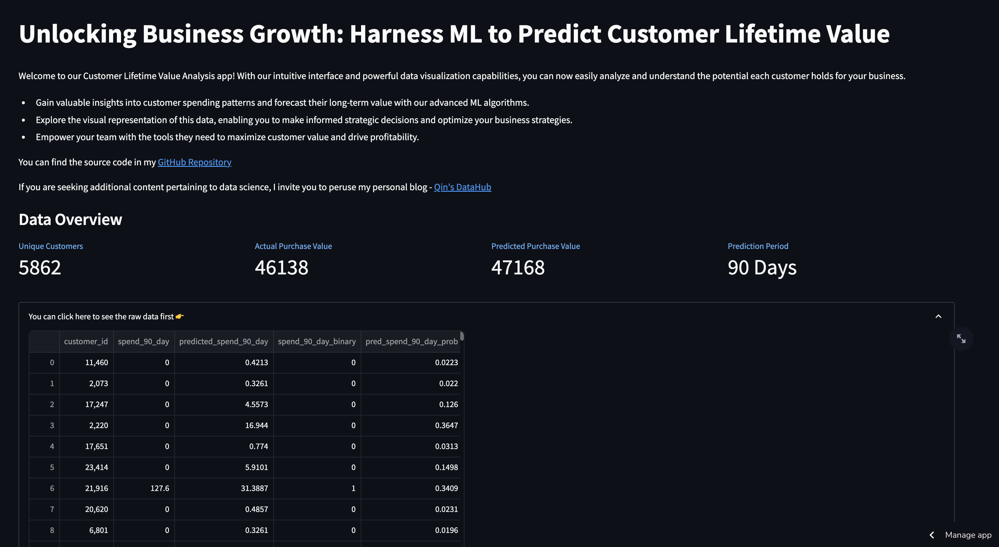
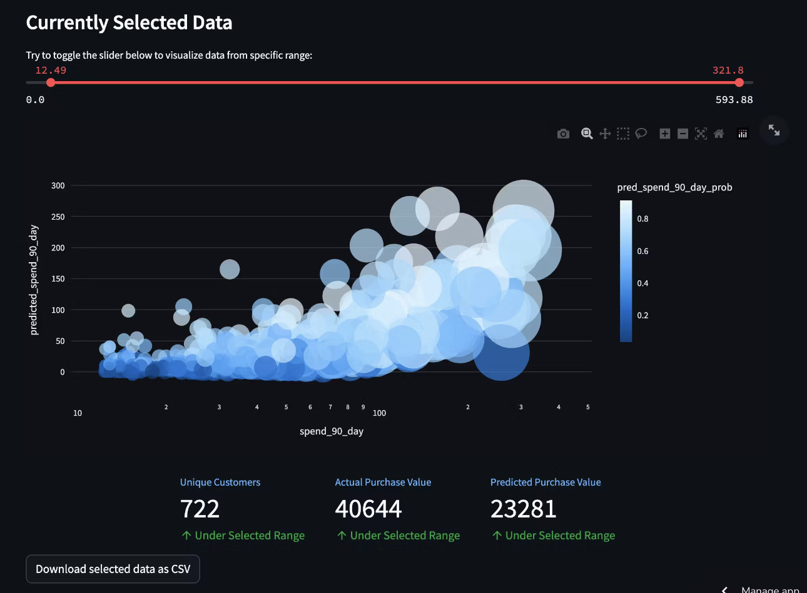

## **Introduction**

This repo contains code and resources for predicting the Customer Lifetime Value, an essential metric that helps businesses understand the long-term value of their customers. By utilizing the power of XGBoost algorithm, this project aims to deliver accurate predictions to aid in strategic decision-making and customer segmentation.

### Explore Documents

* Data Transformation and Feature Engineering: The `main.ipynb` Jupyter Notebook provides a comprehensive pipeline for data transformation, exploratory data analysis (EDA), and feature engineering. Here, we calculate Recency, Frequency, and Monetary (RFM) features to quantify customer behavior and create informative predictors for the model.

* Model Training and Evaluation: The `main.ipynb` also encompasses the training and hyperparameter tuning of the XGBoost model using the `xgboost.cv` function. The model's performance is evaluated using appropriate metrics, ensuring its accuracy and reliability.

* Visualization using Streamlit: The `visualization.py` script contains the code to create an interactive Streamlit app that demonstrates the results of the CLV prediction model. The app allows users to understand and segment their customer base effectively.

### How to Use

To utilize this Customer Lifetime Value Prediction project, follow these steps:

* Clone the Repository: Begin by cloning this repository to your local machine using the following command: `git clone https://github.com/your-username/your-repo-name.git`

* Install Dependencies: Navigate to the project directory and install the required dependencies using the requirements.txt file: `pip install -r requirements.txt`

* Data Transformation and Feature Engineering: Open the `main.ipynb` Jupyter Notebook and follow the step-by-step instructions to transform the data, perform EDA, and engineer the necessary RFM features.

* Model Training and Evaluation: Continue with the `main.ipynb` Notebook to train the XGBoost model and evaluate its performance using cross-validation techniques.

* Visualization using Streamlit: To use the Streamlit app for CLV prediction visualization, execute the following command in your terminal: `streamlit run visualization.py`. Access the app through your web browser by visiting http://localhost:8501, where you can visualize the model prediction results.
